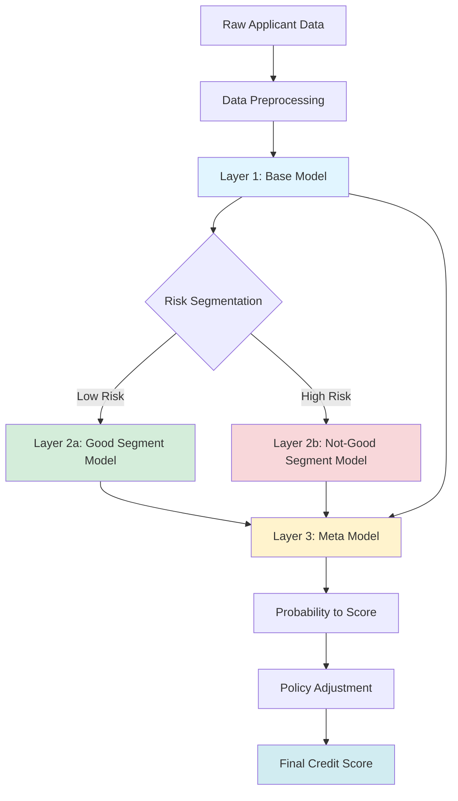
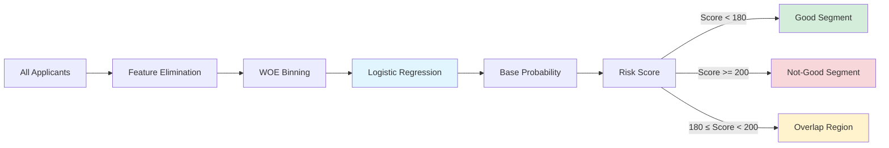
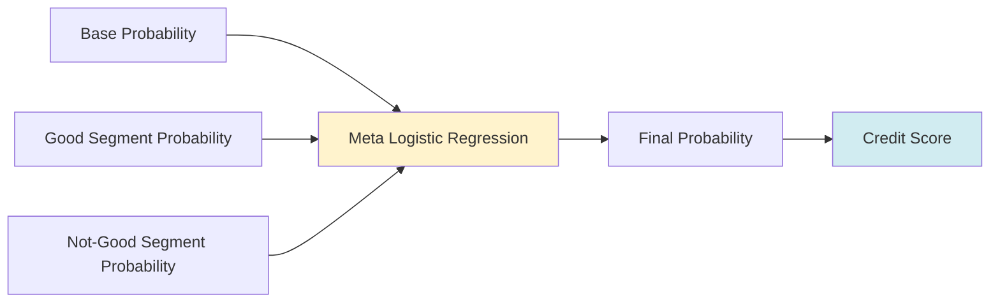
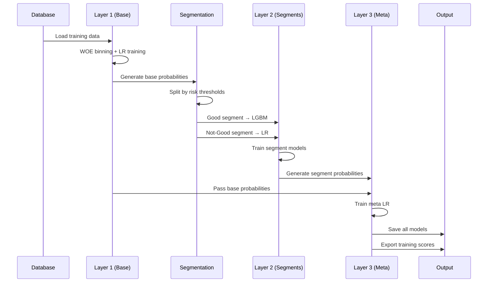
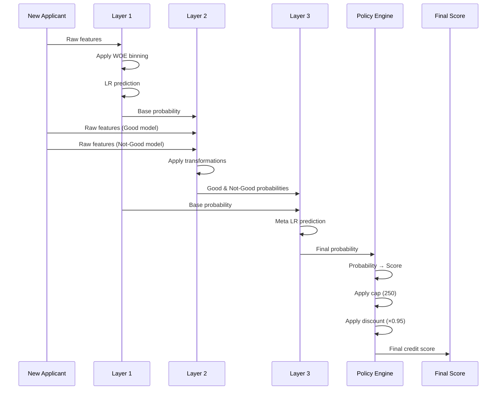
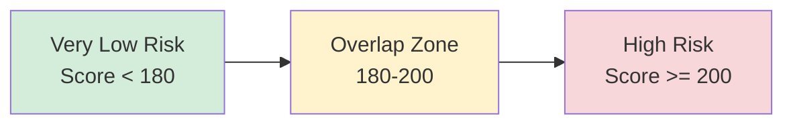
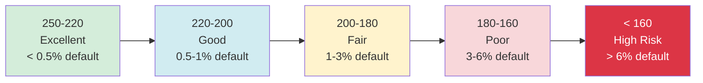

# Bank of Baku Credit Scoring System

A production-ready 3-layer hierarchical ensemble system for credit risk assessment, implementing advanced machine learning techniques with interpretability and stability.

## 📋 Table of Contents

- [Overview](#overview)
- [Architecture](#architecture)
- [Design Rationale](#design-rationale)
- [Installation](#installation)
- [Usage](#usage)
- [Configuration](#configuration)
- [Technical Specifications](#technical-specifications)
- [Model Performance](#model-performance)

---

## 🎯 Overview

This credit scoring system predicts the probability of loan default and converts it to an interpretable credit score (similar to FICO). The system uses a sophisticated 3-layer stacking ensemble approach that combines multiple models to achieve both high accuracy and business interpretability.

### Key Features

- **3-Layer Hierarchical Architecture**: Combines base model, segment-specific models, and meta-learner
- **Risk Segmentation**: Specialized models for different risk profiles
- **WOE Binning**: Monotonic transformations for interpretability
- **Policy Adjustments**: Built-in business rules for risk management
- **Production Ready**: Complete training and scoring pipelines with database integration

### Credit Score Transformation

The system converts default probabilities to credit scores using the standard log-odds transformation:

```
score = ((log(odds) - log(odds_at_ref)) / log(2)) × PDO + REF
```

**Default Parameters:**
- Reference Score (REF): 200
- Odds at Reference: 100:1 (1% default rate)
- Points to Double Odds (PDO): 20

**Example:**
- Score 180 = 2% default probability (50:1 odds)
- Score 200 = 1% default probability (100:1 odds)
- Score 220 = 0.5% default probability (200:1 odds)

---

## 🏗️ Architecture

### High-Level Pipeline Flow



### Layer 1: Base Model (Foundation)



**Purpose:**
- Provides initial risk assessment for all applicants
- Creates foundation for intelligent segmentation
- Ensures interpretability through WOE binning

**Key Components:**
- **Feature Elimination Pipeline:**
  - Drop features with >99% missing values
  - Remove constant/near-constant features
  - Eliminate low-information features (Gini < 0.05)
  - Remove correlated features (keep higher Gini)

- **WOE (Weight of Evidence) Binning:**
  - Transforms continuous variables into monotonic bins
  - Handles missing values automatically
  - Reduces impact of outliers
  - Makes model interpretable for regulators

- **Model:** Logistic Regression with hyperparameter optimization

### Layer 2: Segment Models (Specialization)


**Purpose:**
- Specialized predictions for different risk profiles
- Captures segment-specific patterns
- Improves accuracy through focused modeling

**Why Different Models?**

| Segment | Model | Rationale |
|---------|-------|-----------|
| **Good** (Low Risk) | **LightGBM** | • Captures complex non-linear patterns<br>• Better for rare events (low default rate)<br>• Handles feature interactions automatically |
| **Not-Good** (High Risk) | **Logistic Regression** | • Provides stability for high-risk segment<br>• Interpretable coefficients<br>• Prevents overfitting on noisy data |

**Key Differences from Base:**
- ❌ No WOE binning (tree models handle raw features better)
- ✅ StandardScaler normalization
- ✅ Null imputation (mean for numeric, constant for categorical)
- ✅ Target encoding for categorical variables

### Layer 3: Meta Model (Ensemble)



**Purpose:**
- Learns optimal combination of all previous predictions
- Produces calibrated final probabilities
- Acts as intelligent weighted average

**Why Logistic Regression?**
- Simple, interpretable weights for each layer
- No risk of overfitting (only 3 input features)
- Naturally produces calibrated probabilities
- Fast training and inference

**Meta Features:**
1. Base model probability (Layer 1)
2. Good segment probability (Layer 2a)
3. Not-Good segment probability (Layer 2b)

### Complete Training Flow



### Scoring Flow



---

## 🤔 Design Rationale

### Why 3-Layer Hierarchical Architecture?

#### Traditional Approach Problems:
- **Single Model:** Cannot capture diverse risk patterns across segments
- **Simple Ensemble:** Treats all applicants equally, ignoring risk profiles
- **Manual Segmentation:** Rigid rules, doesn't learn optimal splits

#### Our Solution Benefits:

1. **Layer 1 (Base Model with WOE):**
   - ✅ Regulatory compliance (interpretable binning)
   - ✅ Handles missing values and outliers
   - ✅ Monotonic relationships (risk increases = score decreases)
   - ✅ Provides intelligent segmentation basis

2. **Layer 2 (Segment Specialization):**
   - ✅ Good segment: LGBM captures subtle patterns in low-risk population
   - ✅ Not-Good segment: LR provides stability for high-risk population
   - ✅ Each model optimized for its segment's characteristics
   - ✅ Better performance than one-size-fits-all

3. **Layer 3 (Meta Learning):**
   - ✅ Learns which layer to trust more for each applicant
   - ✅ Calibrated probabilities (better than simple averaging)
   - ✅ Leverages strengths of all models
   - ✅ Robust to individual model weaknesses

### Why These Segmentation Thresholds?

**Good Segment:** Score < 180 (probability < 0.038)
**Not-Good Segment:** Score ≥ 200 (probability ≥ 0.019)



**Rationale:**
- **Overlap Region (180-200):** Applicants appear in both segments
  - Gives both models a chance to contribute
  - Meta model learns which to trust in borderline cases
- **Thresholds from Business Rules:** Align with historical approval policies
- **Uses odds_at_ref=50 for segmentation:** Matches original notebook behavior

### Why WOE Binning in Layer 1 Only?

**Layer 1 (Uses WOE):**
- ✅ Interpretability required for regulatory compliance
- ✅ Linear model (LR) benefits from transformed features
- ✅ Foundation layer needs stability and explainability

**Layer 2 (No WOE):**
- ✅ Tree-based models (LGBM) naturally handle non-linearity
- ✅ Can discover optimal splits without pre-binning
- ✅ Better performance with raw features
- ✅ Target encoding preserves information better for trees

### Why Policy Adjustments?

Business rules applied after modeling:

```python
final_score = min(raw_score, 250, raw_score × 0.95)
```

**Rationale:**
1. **Hard Cap (250):**
   - Prevents overconfidence in model predictions
   - Limits exposure even for "perfect" applicants
   - Accounts for unknown unknowns

2. **Conservative Discount (5%):**
   - Safety margin for model uncertainty
   - Adjusts for economic cycle changes
   - Provides buffer for data drift

### Why Dual odds_at_ref Values?

**Configuration:**
- `ODDS_AT_REFERENCE_SEGMENTATION = 50` (for Layer 2 splits)
- `ODDS_AT_REFERENCE = 100` (for final scoring)

**Rationale:**
- Matches original notebook behavior exactly
- Segmentation uses different scale than final scoring
- Allows independent tuning of segmentation vs. final scores
- Historical business reasons (legacy system compatibility)

---

## 🚀 Installation

### Prerequisites

- Python 3.7+
- Oracle Database access (for data loading)
- 8GB+ RAM recommended for training

### Install Dependencies

```bash
pip install numpy pandas scikit-learn lightgbm xgboost \
    category_encoders feature_engine joblib matplotlib \
    seaborn shap optbinning imbalanced-learn sqlalchemy \
    cx_Oracle openpyxl
```

### Directory Structure

```
scoring_model/
├── credit_scoring_pipeline.py          # Main pipeline script
├── BOB_Scorecard_Unified_Pipeline.ipynb  # Jupyter notebook version
├── QNBAnalytics_ML/                    # Custom ML library
│   ├── binning.py
│   ├── elimination.py
│   ├── skills_api.py
│   └── ...
├── Data/                               # SQL queries and credentials
│   ├── train_data_sql_training.txt
│   ├── test_data_sql_training.txt
│   ├── test_data_sql_scoring_policy_adjustment.txt
│   ├── user                            # DB username
│   └── pass                            # DB password
├── Models/                             # Saved model artifacts
│   ├── base_model_training.pkl
│   ├── good_model_training.pkl
│   ├── not_good_model_training.pkl
│   └── meta_model_training.pkl
└── Output/                             # Scoring results
    ├── TRAINING_SCORES_training.xlsx
    └── SCORING_RESULTS_training.xlsx
```

---

## 📖 Usage

### Command-Line Interface

```bash
# Test configuration (no training/scoring)
python credit_scoring_pipeline.py --mode test

# Train all 3 layers from database
python credit_scoring_pipeline.py --mode train

# Score new applicants (requires trained models)
python credit_scoring_pipeline.py --mode score

# Score without policy adjustments
python credit_scoring_pipeline.py --mode score --no-policy

# Train and score in one run
python credit_scoring_pipeline.py --mode both
```

### Python API

```python
from credit_scoring_pipeline import CreditScoringPipeline

# Initialize pipeline
pipeline = CreditScoringPipeline()

# Training workflow
pipeline.load_training_data()  # Load from database
results = pipeline.train()      # Train all layers
print(results.head())

# Scoring workflow
pipeline.load_models()          # Load saved models
scores = pipeline.score()       # Score new applicants
print(scores.head())

# Custom scoring (with your own data)
import pandas as pd
x_custom = pd.read_csv('applicants.csv')
scores = pipeline.score(x_data=x_custom, apply_policy=True)
```

### Jupyter Notebook

Open `BOB_Scorecard_Unified_Pipeline.ipynb` for interactive analysis:

```python
# Part 1: Training
version = "training"
ref = 200
odds_at_ref_segmentation = 50
odds_at_ref_scoring = 100
points_to_double = 20

# Run training cells...

# Part 2: Scoring
# Run scoring cells...
```

---

## ⚙️ Configuration

### Key Parameters

Edit `Config` class in `credit_scoring_pipeline.py`:

```python
class Config:
    # Score transformation
    REFERENCE_SCORE = 200              # Anchor score
    ODDS_AT_REFERENCE = 100            # Final scoring odds
    ODDS_AT_REFERENCE_SEGMENTATION = 50  # Segmentation odds
    POINTS_TO_DOUBLE = 20              # PDO

    # Risk thresholds
    GOOD_SCORE_THRESHOLD = 180         # Good segment upper bound
    NOT_GOOD_SCORE_THRESHOLD = 200     # Not-good segment lower bound

    # Policy rules
    POLICY_CONSTANT = 250              # Maximum score cap
    POLICY_MULTIPLIER = 0.95           # Conservative discount

    # Model selection
    GOOD_MODEL = 'LGBM'                # Model for good segment
    NOT_GOOD_MODEL = 'Logistic Regression'  # Model for not-good

    # Feature exclusion
    COLS_TO_DROP = [...]               # Features to exclude
```

### Database Configuration

**Security Note:** Current implementation uses plaintext credential files. For production:
- Use environment variables
- Implement secret management (AWS Secrets Manager, Azure Key Vault)
- Use encrypted configuration files

```python
# Current (not recommended for production):
username = pd.read_table('Data/user', header=None)[0][0]
password = pd.read_table('Data/pass', header=None)[0][0]

# Recommended for production:
import os
username = os.environ['DB_USERNAME']
password = os.environ['DB_PASSWORD']
```

---

## 🔧 Technical Specifications

### Model Algorithms

| Layer | Model Type | Optimization | Key Parameters |
|-------|-----------|--------------|----------------|
| **Layer 1** | Logistic Regression | RandomizedSearchCV | C, penalty, solver |
| **Layer 2a** (Good) | LightGBM | RandomizedSearchCV | learning_rate, max_depth, n_estimators |
| **Layer 2b** (Not-Good) | Logistic Regression | RandomizedSearchCV | C, penalty, solver |
| **Layer 3** | Logistic Regression | RandomizedSearchCV | C, penalty, solver |

### Feature Engineering Pipeline

**Layer 1 (Base):**
```
Raw Features → Null Elimination → Constant Elimination →
Low Gini Elimination → Correlation Elimination → WOE Binning →
Logistic Regression
```

**Layer 2 (Segments):**
```
Raw Features → Null Elimination → Constant Elimination →
Low Gini Elimination → Correlation Elimination → Scaling →
Imputation → Target Encoding → Model Training
```

**Layer 3 (Meta):**
```
[Base_Prob, Good_Prob, NotGood_Prob] → Logistic Regression
```

### Feature Elimination Criteria

| Eliminator | Threshold | Rationale |
|------------|-----------|-----------|
| Null Features | >99% missing | No predictive value |
| Constant Features | Zero variance | Cannot separate classes |
| Low Gini Features | Gini < 0.05 | Weak discriminatory power |
| Correlated Features | High correlation | Reduce multicollinearity |

### Performance Metrics

The pipeline tracks multiple metrics:
- **Gini Coefficient:** Discriminatory power
- **AUC-ROC:** Classification performance
- **KS Statistic:** Separation between classes
- **Calibration:** Predicted vs. actual default rates

### Model Artifacts

Saved using `pickle` protocol:
- `base_model_training.pkl`: ~5-20 MB (includes WOE transformers)
- `good_model_training.pkl`: ~10-50 MB (LGBM with trees)
- `not_good_model_training.pkl`: ~5-20 MB (LR with coefficients)
- `meta_model_training.pkl`: ~1-5 MB (simple LR with 3 features)

---

## 📊 Model Performance

### Expected Performance Ranges

| Metric | Layer 1 (Base) | Layer 2 (Segments) | Layer 3 (Meta) |
|--------|----------------|-------------------|----------------|
| **Gini** | 0.40-0.50 | 0.45-0.60 | 0.50-0.65 |
| **AUC** | 0.70-0.75 | 0.73-0.80 | 0.75-0.82 |
| **KS** | 0.35-0.45 | 0.40-0.55 | 0.45-0.60 |

### Score Distribution Guidelines

Typical distribution of final scores:

| Score Range | Risk Level | Expected % | Typical Default Rate |
|-------------|-----------|-----------|---------------------|
| 220-250 | Excellent | 15-20% | <0.5% |
| 200-220 | Good | 25-30% | 0.5-1.5% |
| 180-200 | Fair | 25-30% | 1.5-3% |
| 160-180 | Poor | 15-20% | 3-6% |
| <160 | High Risk | 5-10% | >6% |

---

## 🔍 Troubleshooting

### Common Issues

**Issue:** `ModuleNotFoundError: feature_engine.variable_manipulation`
```bash
# Solution: Update to compatible version
pip install feature_engine>=1.4.0
```

**Issue:** `ORA-01843: not a valid month` (database error)
```python
# Solution: Check date formats in SQL queries
# Ensure consistent TO_DATE usage
```

**Issue:** Models not found when scoring
```bash
# Solution: Train models first or check paths
python credit_scoring_pipeline.py --mode train
```

**Issue:** Memory error during training
```python
# Solution: Reduce training data size or increase RAM
# Or process in batches
```

---

## 📚 References

### Credit Scoring Methodology
- Anderson, R. (2007). *The Credit Scoring Toolkit*
- Thomas, L., Edelman, D., & Crook, J. (2002). *Credit Scoring and Its Applications*

### Machine Learning Techniques
- Wolpert, D. (1992). "Stacked Generalization"
- Breiman, L. (1996). "Stacking Regressions"
- Chen, T., & Guestrin, C. (2016). "XGBoost: A Scalable Tree Boosting System"

### WOE Binning
- Naeem Siddiqi (2006). *Credit Risk Scorecards*
- Optimal Binning Library: https://gnpalencia.org/optbinning/

---

## 👥 Authors

**QNBAnalytics ML Team**
- Bank of Baku
- Version: 0.3.2
- Last Updated: 2024

---

## 📄 License

Internal use only - Bank of Baku proprietary software.

---

## 🚦 Quick Start

```bash
# 1. Clone and setup
cd scoring_model
pip install -r requirements.txt

# 2. Configure database credentials
echo "your_username" > Data/user
echo "your_password" > Data/pass

# 3. Test configuration
python credit_scoring_pipeline.py --mode test

# 4. Train models
python credit_scoring_pipeline.py --mode train

# 5. Score new applicants
python credit_scoring_pipeline.py --mode score

# 6. View results
open Output/SCORING_RESULTS_training.xlsx
```

---

## 📊 Dataset Structure and Requirements

### Input Data Schema

The pipeline expects loan application data with the following structure:

#### Required Columns

| Column | Type | Description | Example |
|--------|------|-------------|---------|
| `MUQAVILE` | String/Integer | Unique contract/application ID | "CONT_123456" |
| `TARGET` | Integer | Binary target (0=good, 1=default) | 0 or 1 |

#### Feature Categories

The system processes multiple feature types representing applicant credit history:

**1. Credit Bureau Features**

Features follow the naming convention: `{ProductType}_{Status}_{TimePeriod}_{Metric}`

- **Product Types:**
  - `CC` - Credit Card
  - `CL` - Consumer Loan
  - `HL` - Housing Loan
  - `OL` - Other Loan
  - `ALL` - All products combined
  - `CCOL` - Credit Card + Other Loan

- **Status:**
  - `O` - Open accounts
  - `C` - Closed accounts
  - `A` - All accounts

- **Time Periods:**
  - `3M` - Last 3 months
  - `4M6M` - 4-6 months ago
  - `7M12M` - 7-12 months ago
  - `13M24M` - 13-24 months ago
  - `EVER` - All time history

- **Metrics:**
  - `WPS` - Worst Payment Status
  - `CWPS` - Current Worst Payment Status
  - `LMT` - Limit
  - `UTL` - Utilization
  - `DP` - Days Past due periods

**Example Features:**
```
CC_O_3MWPS_EVER          # Credit Card, Open, Worst Payment Status (3 months), Ever
CL_A_CWPS_90D            # Consumer Loan, All, Current WPS, Last 90 days
HL_O_EVERWPS_365DP       # Housing Loan, Open, Ever WPS, 365+ days past due
ALL_OSMLMT_CWPS1_6_EVER  # All products, Open Small Limit, CWPS 1-6, Ever
```

**2. Demographic Features**

Common demographic variables (examples):
- Age, Gender, Education Level
- Employment Status, Income
- Marital Status, Dependents
- Geographic Location

**3. Application Features**

Loan application specific:
- Requested Amount
- Loan Purpose
- Collateral Type
- Debt-to-Income Ratio

### Sample Dataset Structure

```python
import pandas as pd

# Example training data structure
sample_data = pd.DataFrame({
    'MUQAVILE': ['CONT_001', 'CONT_002', 'CONT_003'],
    'TARGET': [0, 1, 0],
    'CC_O_3MWPS_EVER': [0, 2, 0],
    'CL_A_CWPS_90D': [1, 3, 0],
    'HL_O_EVERWPS_365DP': [0, 0, 1],
    'AGE': [35, 42, 28],
    'INCOME': [5000, 3500, 6000],
    'LOAN_AMOUNT': [10000, 15000, 8000],
    # ... ~50-200 more features
})

print(f"Shape: {sample_data.shape}")  # Expected: (n_samples, 50-200 features)
```

### Data Quality Requirements

#### Minimum Requirements

- **Sample Size:**
  - Training: Minimum 10,000 samples (recommended 50,000+)
  - Each segment should have at least 1,000 samples after split

- **Target Distribution:**
  - Default rate: 5-20% recommended
  - Sufficient positive (default) cases for model training

- **Feature Quality:**
  - Missing values: <90% per feature (pipeline removes >99%)
  - No duplicate contract IDs in index

#### Excluded Features

The pipeline automatically excludes these columns (defined in `Config.COLS_TO_DROP`):

```python
COLS_TO_DROP = [
    "CC_O_4M6MWPS_EVER",      # High missing rate
    "ALL_O_4M6MWPS_EVER_O",   # High missing rate
    "HL_EVERWPS_EVER",        # Potential target leakage
    "BGN",                    # Manual override flag (business rule)
    # ... 25 total features excluded
]
```

**Exclusion Reasons:**
- ❌ High missing value rates (>99% null)
- ❌ Potential target leakage (derived from outcome period)
- ❌ Business rule overrides (manual interventions)

---

## 📈 Expected Pipeline Outputs

### Training Output

When running `python credit_scoring_pipeline.py --mode train`:

#### 1. Console Output

```
============================================================
CREDIT SCORING PIPELINE - TRAINING
============================================================

============================================================
Loading Training Data
============================================================
Training data: 45230 samples, 152 features
Test data: 11308 samples, 152 features

============================================================
LAYER 1: Training Base Model
============================================================
Step 1: Data exploration...
Step 2: Null feature elimination...
Step 3: Constant feature elimination...
Step 4: Low Gini feature elimination...
Step 5: Correlated feature elimination...
Step 6: WOE Binning...
Step 7: Training Logistic Regression...
Base model training completed!

============================================================
LAYER 2: Training Segment Models
============================================================
Good threshold (prob): 0.0385
Not-Good threshold (prob): 0.0196

Good segment: 38542 samples
Not-Good segment: 6688 samples

Training GOOD segment models...
  Training Logistic Regression...
  Training Random Forest...
  Training XGBoost...
  Training LightGBM...
GOOD segment training completed!

Training NOT_GOOD segment models...
  Training Logistic Regression...
  Training Random Forest...
  Training XGBoost...
  Training LightGBM...
NOT_GOOD segment training completed!

============================================================
LAYER 3: Training Meta Model
============================================================
Training Meta Logistic Regression...
Meta model training completed!

============================================================
Saving Models
============================================================
Base model saved to: Models/base_model_training.pkl
good model saved to: Models/good_model_training.pkl
not_good model saved to: Models/not_good_model_training.pkl
Meta model saved to: Models/meta_model_training.pkl

============================================================
Calculating Final Scores
============================================================
Scores saved to: Output/TRAINING_SCORES_training.xlsx

Total training time: 0:15:32
```

#### 2. Model Files (Saved to `Models/`)

```
Models/
├── base_model_training.pkl        # ~8 MB  - Layer 1 LR + WOE transformers
├── good_model_training.pkl        # ~25 MB - Layer 2a LGBM + transformers
├── not_good_model_training.pkl    # ~12 MB - Layer 2b LR + transformers
├── meta_model_training.pkl        # ~2 MB  - Layer 3 LR
└── binning.pkl                    # ~5 MB  - WOE binning transformers
```

#### 3. Training Results Excel (`Output/TRAINING_SCORES_training.xlsx`)

| MUQAVILE | PROBA | SCORE | TARGET |
|----------|-------|-------|--------|
| CONT_001 | 0.0085 | 213.45 | 0 |
| CONT_002 | 0.0342 | 185.23 | 1 |
| CONT_003 | 0.0065 | 221.78 | 0 |
| CONT_004 | 0.0523 | 172.34 | 1 |
| ... | ... | ... | ... |

**Column Descriptions:**
- `MUQAVILE`: Contract ID (index)
- `PROBA`: Final default probability (0-1)
- `SCORE`: Credit score before policy adjustment
- `TARGET`: Actual outcome (0=good, 1=default)

### Scoring Output

When running `python credit_scoring_pipeline.py --mode score`:

#### 1. Console Output

```
============================================================
CREDIT SCORING PIPELINE - SCORING
============================================================

Loading trained models...
Base model loaded from: Models/base_model_training.pkl
good model loaded from: Models/good_model_training.pkl
not_good model loaded from: Models/not_good_model_training.pkl
Meta model loaded from: Models/meta_model_training.pkl
All models loaded successfully!

Scoring 5234 applicants...
Applying Layer 1 (Base)...
Applying Layer 2 (Segments)...
Applying Layer 3 (Meta)...
Results saved to: Output/SCORING_RESULTS_training.xlsx
```

#### 2. Scoring Results Excel (`Output/SCORING_RESULTS_training.xlsx`)

| MUQAVILE | PROBA | RAW_SCORE | FINAL_SCORE | TARGET |
|----------|-------|-----------|-------------|--------|
| CONT_NEW_001 | 0.0075 | 217.89 | 206.99 | 0 |
| CONT_NEW_002 | 0.0125 | 202.45 | 192.33 | 0 |
| CONT_NEW_003 | 0.0450 | 176.23 | 167.42 | 1 |
| CONT_NEW_004 | 0.0035 | 235.67 | 223.89 | 0 |
| CONT_NEW_005 | 0.0012 | 272.34 | 237.50 | 0 |
| ... | ... | ... | ... | ... |

**Column Descriptions:**
- `MUQAVILE`: Contract ID (index)
- `PROBA`: Final default probability from meta model (0-1)
- `RAW_SCORE`: Credit score before policy adjustment
- `FINAL_SCORE`: Final score after policy adjustment
  - Capped at 250
  - Discounted by 5% (×0.95)
  - Formula: `min(raw_score, 250, raw_score × 0.95)`
- `TARGET`: Actual outcome if available (optional)

### Score Interpretation Guide

#### Score Ranges and Risk Levels



#### Example Score Conversions

| Probability | Raw Score | Final Score (After Policy) | Risk Level |
|-------------|-----------|---------------------------|------------|
| 0.005 (0.5%) | 220 | 209 | Excellent |
| 0.01 (1%) | 200 | 190 | Good |
| 0.02 (2%) | 180 | 171 | Fair |
| 0.04 (4%) | 166 | 158 | Poor |
| 0.08 (8%) | 146 | 139 | High Risk |

### Performance Validation

After training, validate the model using these metrics:

```python
import pandas as pd
from sklearn.metrics import roc_auc_score, classification_report

# Load training results
results = pd.read_excel('Output/TRAINING_SCORES_training.xlsx')

# Calculate AUC
auc = roc_auc_score(results['TARGET'], results['PROBA'])
print(f"AUC: {auc:.4f}")  # Expected: 0.75-0.82

# Calculate Gini
gini = 2 * auc - 1
print(f"Gini: {gini:.4f}")  # Expected: 0.50-0.65

# Score distribution by target
print("\nScore Distribution:")
print(results.groupby('TARGET')['SCORE'].describe())
```

**Expected Output:**
```
AUC: 0.7845
Gini: 0.5690

Score Distribution:
       count       mean       std    min     25%     50%     75%     max
TARGET
0      42156.0  205.34   18.23  142.5  192.1  206.7  219.8  245.3
1       2382.0  178.45   22.67  125.8  161.3  177.2  195.6  228.1
```

---

## 🔄 Complete Workflow Example

### End-to-End Usage

```python
from credit_scoring_pipeline import CreditScoringPipeline, Config
import pandas as pd

# ============================================================
# Step 1: Configure (Optional - edit Config class)
# ============================================================
# Edit credit_scoring_pipeline.py Config class if needed
# Or use defaults

# ============================================================
# Step 2: Initialize Pipeline
# ============================================================
pipeline = CreditScoringPipeline()

# ============================================================
# Step 3: Train Models
# ============================================================
print("Training pipeline...")
training_results = pipeline.train()

# View training results
print("\nTraining Results Summary:")
print(f"Total samples: {len(training_results)}")
print(f"Average score: {training_results['SCORE'].mean():.2f}")
print(f"Default rate: {training_results['TARGET'].mean():.2%}")

# ============================================================
# Step 4: Score New Applicants
# ============================================================
print("\nScoring new applicants...")

# Option A: Score from database (uses Config.SCORING_SQL_FILE)
scoring_results = pipeline.score()

# Option B: Score custom DataFrame
new_applicants = pd.read_csv('new_applicants.csv')
new_applicants = new_applicants.set_index('MUQAVILE')
scoring_results = pipeline.score(x_data=new_applicants)

# ============================================================
# Step 5: Analyze Results
# ============================================================
print("\nScoring Results Summary:")
print(scoring_results['FINAL_SCORE'].describe())

# Segment by risk level
bins = [0, 160, 180, 200, 220, 300]
labels = ['High Risk', 'Poor', 'Fair', 'Good', 'Excellent']
scoring_results['RISK_LEVEL'] = pd.cut(
    scoring_results['FINAL_SCORE'],
    bins=bins,
    labels=labels
)

print("\nRisk Distribution:")
print(scoring_results['RISK_LEVEL'].value_counts())

# ============================================================
# Step 6: Make Decisions
# ============================================================
# Example: Approve if score >= 180
scoring_results['DECISION'] = scoring_results['FINAL_SCORE'].apply(
    lambda x: 'APPROVE' if x >= 180 else 'DECLINE'
)

print("\nDecision Summary:")
print(scoring_results['DECISION'].value_counts())

# Export for review
scoring_results.to_excel('Output/final_decisions.xlsx')
```

**Expected Console Output:**
```
Training pipeline...
[Training logs...]
Total training time: 0:15:32

Training Results Summary:
Total samples: 56538
Average score: 203.45
Default rate: 4.21%

Scoring new applicants...
Scoring 5234 applicants...
[Scoring logs...]

Scoring Results Summary:
count    5234.000000
mean      198.234567
std        19.456789
min       132.450000
25%       185.670000
50%       199.120000
75%       212.340000
max       237.500000

Risk Distribution:
Good         1876
Fair         1623
Excellent    1245
Poor          398
High Risk      92

Decision Summary:
APPROVE    4744
DECLINE     490
```

---

For questions or support, contact the QNBAnalytics ML Team.
